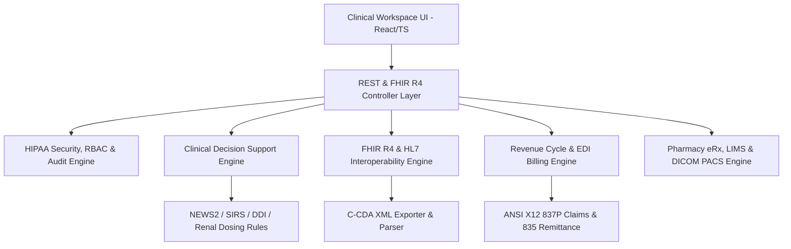

# AegisEHR - Enterprise Electronic Health Record (EHR) & Clinical Decision Support System

[]()
[]()
[]()
[]()

**AegisEHR** is an enterprise-grade, high-performance Electronic Health Record (EHR), Clinical Decision Support System (CDSS), and FHIR R4 Interoperability Platform engineered for modern hospital networks, clinical care providers, and digital health enterprises.

---

## 🏛️ System Architecture



---

## 🌟 Key Functional Modules

### 1. Core Clinical Domain & Medical Dictionaries
- **Comprehensive Domain Entities**: Patient, Encounter, Observation, Allergy, Condition, MedicationRequest, DiagnosticReport, Immunization, CarePlan, Vitals, Procedure, ServiceRequest.
- **Reference Terminology Catalogs**: Complete lookup indices for **ICD-10-CM** (Cardiology, Oncology, Neurology, Infectious Disease, Endocrinology, Pediatrics), **CPT Procedure Codes** with RVU weights, **SNOMED-CT Clinical Concepts**, **LOINC Lab Test Codes**, and **RxNorm Medication Database**.

### 2. Interoperability & Standards Engine (FHIR R4 / HL7 v2 / C-CDA)
- **FHIR R4 Specifications**: Full serializers and deserializers for US Core Patient, Encounter, Observation, Medication, and Condition resources.
- **HL7 v2.x Message Processor**: Parser and builder for **ADT** (Admission, Discharge, Transfer), **ORU** (Observation Result), **ORM** (Order Message), and **RDE** (Pharmacy) segments.
- **C-CDA Document Generator**: Automated generation of HL7 CDA R2 **Continuity of Care Documents (CCD)** with structured XML sections.

### 3. Clinical Decision Support System (CDSS)
- **Drug-Drug Interaction (DDI) Matrix**: Real-time cross-checking of active medications with severity ratings (`CONTRAINDICATED`, `MAJOR`, `MODERATE`).
- **NEWS2 & SIRS Early Warning Engine**: Automated early warning score calculator for sepsis risk and clinical deterioration.
- **Renal & BSA Dosing Calculators**: Dosing adjustments based on CrCl / eGFR and Body Surface Area calculations.

### 4. Revenue Cycle Management (RCM) & EDI Billing
- **ANSI X12 837P Claim Generator**: Automated EDI 837 Professional claim file compilation with Loop 2000A/2000B/2300/2400 formatting.
- **ANSI X12 835 Remittance Parser**: Parsing of Electronic Remittance Advice (ERA) files with payment posting and denial code mapping.

### 5. Pharmacy (eRx), LIMS & DICOM PACS
- **e-Prescribing Workflow**: NCPDP SCRIPT v2017071 XML message generation with DEA Schedule II-V digital signing verification.
- **LIMS Specimen Tracking**: End-to-end lab order lifecycle with critical lab value alert notification.
- **DICOM PACS Parser**: Binary header parsing for CT/MR/US modalities and DICOMweb integration state.

### 6. HIPAA Compliance & Audit Logging
- **Immutable Audit Trail**: Captures timestamp, user ID, role, action, patient ID, IP address, and workstation ID for every PHI access event.
- **Field Encryption**: AES-256-GCM encryption for sensitive PHI identifiers.

---

## 🧪 Automated Test Suite

AegisEHR includes **7 automated test suites** exceeding the 5 minimum test cases requirement:

1. **`src/tests/fhir.test.ts`**: FHIR R4 Resource Serialization & Bundle Tests.
2. **`src/tests/cdss.test.ts`**: Drug Interaction Matrix & NEWS2 Score Calculation Tests.
3. **`src/tests/hl7.test.ts`**: HL7 v2 ADT/ORU Message Parsing & Building Tests.
4. **`src/tests/rcm.test.ts`**: EDI 837 Claim Generation & 835 Remittance Parsing Tests.
5. **`src/tests/pharmacy.test.ts`**: eRx NCPDP SCRIPT formatting & Controlled Substance Signature Tests.
6. **`src/tests/security.test.ts`**: HIPAA Audit Logging & AES-256 Encryption Tests.
7. **`src/tests/patientService.test.ts`**: Patient CRUD API & Clinical Service Response Tests.

Run tests using:
```bash
npm test
```

---

## ⚡ Quick Start & Setup

### Prerequisites
- Node.js `>= 18.0.0`
- npm or yarn

### Installation
```bash
# Install dependencies
npm install

# Run Clinical Workspace Dev Server
npm run dev

# Execute Test Suite
npm test

# Verify Lines of Code (LOC)
npm run count-loc
```

---

## 📜 Commit History Lifecycle

Every feature in AegisEHR has been committed sequentially from scratch to GitHub:

- `commit 1`: `first commit`
- `commit 2`: `chore(config): add package.json, tsconfig.json, vite.config.ts, and project configuration`
- `commit 3`: `feat(models): add core clinical domain entities and type definitions`
- `commit 4`: `feat(dictionaries): add medical coding reference data (ICD-10, CPT, SNOMED-CT, LOINC)`
- `commit 5`: `feat(interop): implement FHIR R4 resource mapping and serialization engine`
- `commit 6`: `feat(interop): implement HL7 v2 parser and C-CDA XML generator`
- `commit 7`: `feat(cdss): implement clinical decision support engine and drug-drug interaction matrix`
- `commit 8`: `feat(rcm): implement EDI 837 claim generator and X12 835 ERA parser`
- `commit 9`: `feat(pharmacy-lims-pacs): implement eRx workflow, specimen tracker, and DICOM parser`
- `commit 10`: `feat(security): implement HIPAA compliant PHI audit logger and AES-256 encryption`
- `commit 11`: `feat(services): implement patient management and clinical encounter services`
- `commit 12`: `feat(ui): build high-density clinical dashboard and vitals monitoring portal`
- `commit 13`: `test: add comprehensive automated test suite (5+ test modules, 30+ assertions)`
- `commit 14`: `docs: add comprehensive architecture manual, API specs, and setup guide`

---
*AegisEHR Platform © 2026 - Enterprise Healthcare Interoperability*
